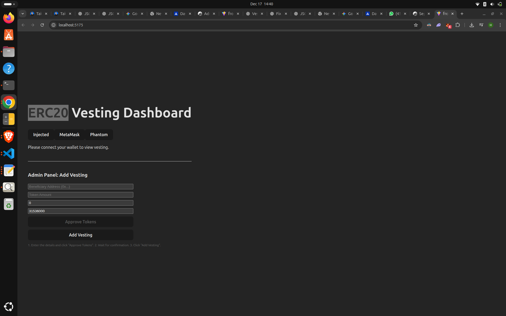
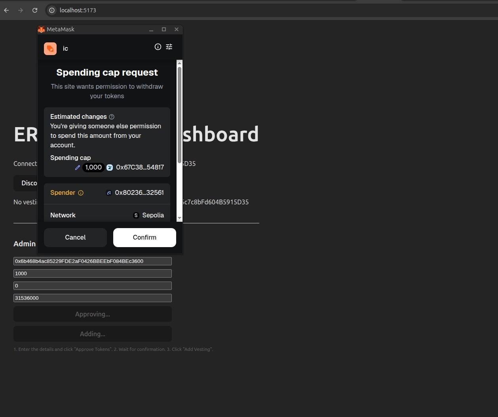

# ERC20 Token Vesting Contract (Solidity)

This project implements a production-style ERC20 token vesting system using Solidity and Foundry.

## Features
- ERC20 token using OpenZeppelin
- Linear vesting with cliff period
- Multiple beneficiaries
- Beneficiary-driven token release
- Owner-controlled vesting revocation
- Full Foundry test coverage

## Vesting Logic
- Tokens remain locked until the cliff period ends
- After the cliff, tokens vest linearly over time
- Beneficiaries can claim vested tokens using `release()`
- If vesting is revoked, beneficiaries receive only vested tokens and the remaining tokens are refunded to the owner

## Tech Stack
- Solidity ^0.8.20
- OpenZeppelin Contracts
- Foundry (testing)

## Tests
The test suite covers:
- No release before cliff
- Partial vesting after cliff
- Full vesting after duration
- Prevention of double claims
- Revocation behavior

## Status
Smart contracts and tests are complete.  
Frontend integration is optional and can be added later.

